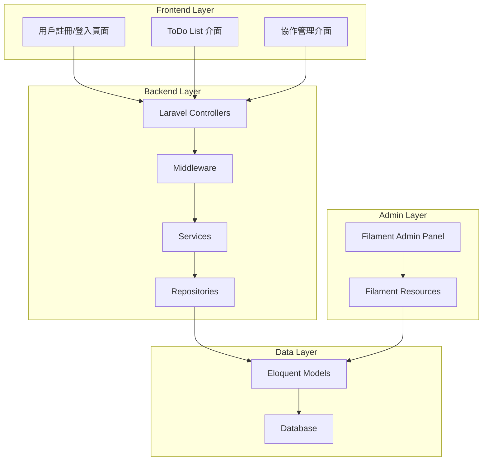

# Design Document

## Overview

協作式 ToDo List 系統將建立在 Laravel 12 和 Filament v4 之上，提供前台用戶介面和後台管理功能。系統採用 MVC 架構模式，使用 Eloquent ORM 進行資料庫操作，並整合 Laravel 的認證系統。

## Architecture

### 系統架構圖



### 技術堆疊

- **後端框架**: Laravel 12
- **管理介面**: Filament v4
- **資料庫**: SQLite (可擴展至 MySQL/PostgreSQL)
- **認證**: Laravel Sanctum
- **前端**: Blade Templates + Alpine.js
- **樣式**: Tailwind CSS

## Components and Interfaces

### 1. 資料模型層 (Models)

#### User Model
```php
class User extends Authenticatable
{
    // 基本用戶資訊
    protected $fillable = ['name', 'email', 'password'];
    
    // 關聯關係
    public function ownedTodos(): HasMany;
    public function collaborativeTodos(): BelongsToMany;
    public function sentInvitations(): HasMany;
    public function receivedInvitations(): HasMany;
}
```

#### Todo Model
```php
class Todo extends Model
{
    protected $fillable = ['title', 'description', 'status', 'user_id'];
    
    // 關聯關係
    public function owner(): BelongsTo;
    public function collaborators(): BelongsToMany;
    public function invitations(): HasMany;
}
```

#### TodoInvitation Model
```php
class TodoInvitation extends Model
{
    protected $fillable = ['todo_id', 'inviter_id', 'invitee_id', 'status'];
    
    // 關聯關係
    public function todo(): BelongsTo;
    public function inviter(): BelongsTo;
    public function invitee(): BelongsTo;
}
```

### 2. 控制器層 (Controllers)

#### AuthController
- 處理用戶註冊、登入、登出
- 使用 Laravel 內建認證功能

#### TodoController
- CRUD 操作 ToDo 項目
- 權限檢查和資料驗證

#### CollaborationController
- 處理邀請發送和接受
- 管理協作者權限

### 3. 服務層 (Services)

#### TodoService
```php
class TodoService
{
    public function createTodo(array $data, User $user): Todo;
    public function updateTodo(Todo $todo, array $data): Todo;
    public function deleteTodo(Todo $todo): bool;
    public function getUserTodos(User $user): Collection;
}
```

#### InvitationService
```php
class InvitationService
{
    public function sendInvitation(Todo $todo, string $email): TodoInvitation;
    public function acceptInvitation(TodoInvitation $invitation): bool;
    public function rejectInvitation(TodoInvitation $invitation): bool;
}
```

### 4. Filament 資源 (Admin Resources)

#### UserResource
- 管理用戶帳號
- 查看用戶統計資訊

#### TodoResource
- 管理所有 ToDo 項目
- 查看項目協作狀況

#### TodoInvitationResource
- 管理邀請記錄
- 監控邀請狀態

## Data Models

### 資料庫結構

#### users 表
```sql
CREATE TABLE users (
    id BIGINT PRIMARY KEY AUTO_INCREMENT,
    name VARCHAR(255) NOT NULL,
    email VARCHAR(255) UNIQUE NOT NULL,
    email_verified_at TIMESTAMP NULL,
    password VARCHAR(255) NOT NULL,
    created_at TIMESTAMP NULL,
    updated_at TIMESTAMP NULL
);
```

#### todos 表
```sql
CREATE TABLE todos (
    id BIGINT PRIMARY KEY AUTO_INCREMENT,
    title VARCHAR(255) NOT NULL,
    description TEXT NULL,
    status ENUM('pending', 'in_progress', 'completed') DEFAULT 'pending',
    user_id BIGINT NOT NULL,
    created_at TIMESTAMP NULL,
    updated_at TIMESTAMP NULL,
    FOREIGN KEY (user_id) REFERENCES users(id) ON DELETE CASCADE
);
```

#### todo_collaborators 表 (多對多關聯)
```sql
CREATE TABLE todo_collaborators (
    id BIGINT PRIMARY KEY AUTO_INCREMENT,
    todo_id BIGINT NOT NULL,
    user_id BIGINT NOT NULL,
    created_at TIMESTAMP NULL,
    updated_at TIMESTAMP NULL,
    FOREIGN KEY (todo_id) REFERENCES todos(id) ON DELETE CASCADE,
    FOREIGN KEY (user_id) REFERENCES users(id) ON DELETE CASCADE,
    UNIQUE KEY unique_collaboration (todo_id, user_id)
);
```

#### todo_invitations 表
```sql
CREATE TABLE todo_invitations (
    id BIGINT PRIMARY KEY AUTO_INCREMENT,
    todo_id BIGINT NOT NULL,
    inviter_id BIGINT NOT NULL,
    invitee_id BIGINT NOT NULL,
    status ENUM('pending', 'accepted', 'rejected') DEFAULT 'pending',
    created_at TIMESTAMP NULL,
    updated_at TIMESTAMP NULL,
    FOREIGN KEY (todo_id) REFERENCES todos(id) ON DELETE CASCADE,
    FOREIGN KEY (inviter_id) REFERENCES users(id) ON DELETE CASCADE,
    FOREIGN KEY (invitee_id) REFERENCES users(id) ON DELETE CASCADE
);
```

## Error Handling

### 1. 認證錯誤處理
- 無效登入憑證：返回適當錯誤訊息
- 未認證存取：重定向至登入頁面
- 權限不足：返回 403 錯誤

### 2. 資料驗證錯誤
- 使用 Laravel Form Request 進行資料驗證
- 自定義驗證規則處理業務邏輯
- 統一錯誤訊息格式

### 3. 業務邏輯錯誤
- 重複邀請檢查
- 自我邀請防護
- 項目存取權限驗證

### 4. 系統錯誤處理
```php
// 全域異常處理
class Handler extends ExceptionHandler
{
    public function render($request, Throwable $exception)
    {
        if ($exception instanceof ModelNotFoundException) {
            return response()->view('errors.404', [], 404);
        }
        
        if ($exception instanceof AuthorizationException) {
            return response()->view('errors.403', [], 403);
        }
        
        return parent::render($request, $exception);
    }
}
```

## Testing Strategy

### 1. 單元測試 (Unit Tests)
- Model 關聯關係測試
- Service 類別方法測試
- 資料驗證規則測試

### 2. 功能測試 (Feature Tests)
- 用戶註冊/登入流程測試
- ToDo CRUD 操作測試
- 邀請功能完整流程測試
- API 端點測試

### 3. 瀏覽器測試 (Browser Tests)
- 使用 Laravel Dusk 進行 E2E 測試
- 用戶介面互動測試
- JavaScript 功能測試

### 4. 測試資料準備
```php
// Factory 定義
class UserFactory extends Factory
{
    public function definition(): array
    {
        return [
            'name' => fake()->name(),
            'email' => fake()->unique()->safeEmail(),
            'password' => Hash::make('password'),
        ];
    }
}

class TodoFactory extends Factory
{
    public function definition(): array
    {
        return [
            'title' => fake()->sentence(),
            'description' => fake()->paragraph(),
            'status' => fake()->randomElement(['pending', 'in_progress', 'completed']),
            'user_id' => User::factory(),
        ];
    }
}
```

### 5. 測試覆蓋率目標
- 模型和服務類別：90% 以上
- 控制器：80% 以上
- 整體專案：85% 以上

## Security Considerations

### 1. 認證與授權
- 使用 Laravel Sanctum 進行 API 認證
- 實作 Policy 類別控制資源存取
- CSRF 保護所有表單提交

### 2. 資料保護
- 密碼使用 bcrypt 加密
- 敏感資料加密存儲
- SQL 注入防護 (Eloquent ORM)

### 3. 輸入驗證
- 所有用戶輸入進行驗證和清理
- XSS 攻擊防護
- 檔案上傳安全檢查

### 4. 權限控制
```php
// Todo Policy 範例
class TodoPolicy
{
    public function view(User $user, Todo $todo): bool
    {
        return $user->id === $todo->user_id || 
               $todo->collaborators->contains($user);
    }
    
    public function update(User $user, Todo $todo): bool
    {
        return $user->id === $todo->user_id || 
               $todo->collaborators->contains($user);
    }
    
    public function delete(User $user, Todo $todo): bool
    {
        return $user->id === $todo->user_id;
    }
}
```